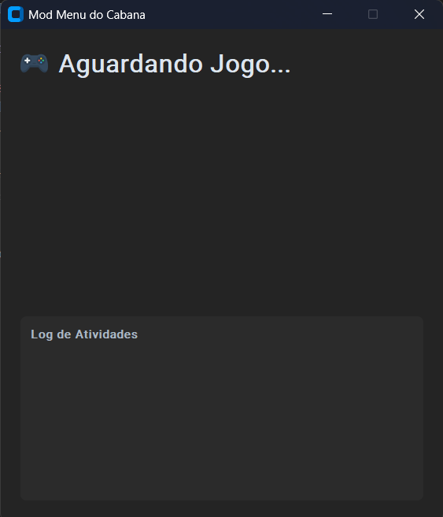
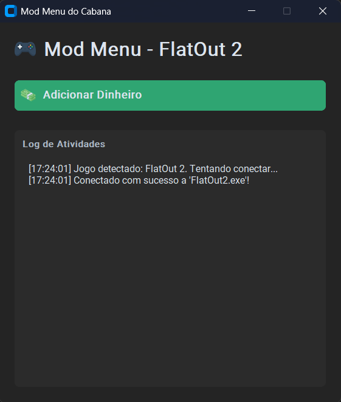
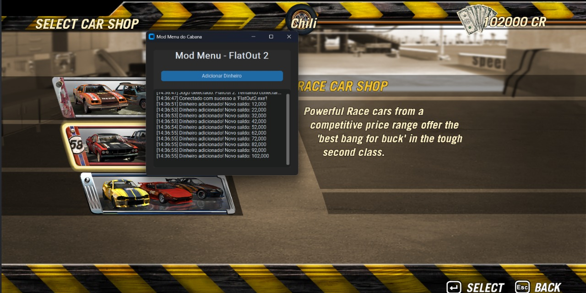

# Mod Menu feito em Python

Um Mod Menu com interface gráfica (GUI) desenvolvido em Python para modificar valores em jogos em tempo de execução. O programa detecta automaticamente jogos em execução (configurados previamente), se conecta ao processo e oferece botões para aplicar "cheats", como adicionar dinheiro, XP, etc.

## 🖼️ Demonstração

### 🔹 1. Aguardando o processo (jogo.exe)



### 🔹 2. Reconhecimento do jogo (FlatOut2)



### 🔹 3. Alteração de dados enquanto executa o jogo



## Como Funciona

A praticidade deste Mod Menu reside na sua capacidade de interagir diretamente com a memória de um jogo enquanto ele está rodando. O processo é dividido em três etapas principais:

#### 1. Detecção e Conexão ao Processo

O script monitora constantemente os processos em execução no sistema operacional. Ele compara a lista de processos com uma lista pré-definida de jogos em `modmenu/config.py`. Ao encontrar um jogo compatível, ele utiliza a biblioteca **Pymem** para se "conectar" a esse processo, ganhando permissão para ler e escrever em sua memória.

#### 2. A Lógica dos Pointers (Ponteiros)

A maioria dos jogos modernos utiliza **alocação dinâmica de memória**. Isso significa que o endereço de memória que armazena um valor, como a sua quantidade de dinheiro, **muda toda vez que o jogo é reiniciado**. Tentar escrever em um endereço fixo (estático) funcionaria apenas para uma única sessão de jogo, tornando o cheat inútil depois.

É aqui que entram os **pointers (ponteiros)**.

Um pointer é basicamente um endereço de memória que, em vez de guardar um valor como "1000 de ouro", guarda o **endereço de outro lugar na memória**. Ao seguir uma cadeia de pointers (um pointer que aponta para outro, que aponta para outro...), podemos encontrar de forma confiável o endereço final e dinâmico do valor que queremos alterar.

#### 3. Interface Gráfica e Interação

A interface, construída com **CustomTkinter**, serve como o painel de controle. Ela é desacoplada da lógica principal (padrão Controller-View):

- **`ui.py` (View):** É responsável apenas por exibir os botões, os ícones e o log. Quando um botão é clicado, ela não sabe o que fazer, apenas notifica o "Controller".
- **`controller.py` (Controller):** É o cérebro. Ele recebe a notificação da UI, aciona a lógica de memória (`GameMemory`) para executar o cheat usando a cadeia de ponteiros correta e, por fim, envia mensagens de status de volta para a UI exibir no log.

## Estrutura do Projeto

```
mod menu/
│
├── src/
│   ├── __init__.py
│   ├── assets/                 # Ícones
│   │   ├── gamepad_icon.png
│   │   ├── money_icon.png
│   │   └── xp_icon.png
│   │
│   ├── core/                   # Lógica principal de memória
│   │   ├── __init__.py
│   │   └── memory.py           # Classe GameMemory que usa Pymem para seguir pointers
│   │
│   ├── utils/                  # Funções utilitárias
│   │   ├── __init__.py
│   │   └── process.py          # Função para detectar processos de jogos
│   │
│   ├── config.py               # ARQUIVO PRINCIPAL DE CONFIGURAÇÃO (endereços, offsets)
│   ├── controller.py           # O cérebro da aplicação (lógica de estado)
│   └── ui.py                   # A interface gráfica (GUI)
│
└── main.py                     # Ponto de entrada para iniciar a aplicação
```

## Requisitos

As seguintes bibliotecas são necessárias para executar o projeto.

- **customtkinter**: Para a interface gráfica moderna.
- **pillow**: Para carregar e manipular as imagens dos ícones.
- **pymem**: Para interagir com a memória dos processos.

## Instalação e Execução

1.  **Clone o repositório:**

    ```bash
    git clone <https://github.com/Cabana021/mod-menu.git>
    cd mod-menu
    ```

2.  **Instale as dependências:**

    ```bash
    pip install customtkinter pillow pymem
    ```

3.  **Execute a aplicação:**
    ```bash
    python main.py
    ```
    O Mod Menu iniciará e ficará "Aguardando Jogo...". Abra um dos jogos configurados para que ele se conecte.

## Como Adicionar um Novo Jogo ou Cheat

Para expandir a funcionalidade do Mod Menu, siga estes passos:

1.  **Encontre a Cadeia de Ponteiros:** Esta é a parte mais crucial. Use o **Cheat Engine** para encontrar a cadeia de ponteiros para o valor que você deseja modificar (ex: dinheiro, XP, munição). Você precisará do **endereço base do módulo** (ex: `game.exe`) e da **sequência de offsets**.

2.  **Atualize o `config.py`:** Adicione uma nova entrada ao dicionário `GAME_CONFIGS`.

    ```python
    GAME_CONFIGS = {
        # ... outros jogos
        "Nome do Novo Jogo": {
            "process_name": "nomedoprocesso.exe",
            "features": {
                "money": "Adicionar Dinheiro",
                "xp": "Adicionar XP",
                # Adicione uma nova feature key aqui
                "ammo": "Munição Infinita"
            },
            "offsets": {
                "money": {"base": "client.dll", "offsets": [0x10A2B4, 0x18, 0x248, 0x4]},
                "xp": {"base": "client.dll", "offsets": [0x10A2B4, 0x18, 0x250, 0x8]},
                 # Adicione os offsets para a nova feature aqui
                "ammo": {"base": "game.exe", "offsets": [0x00123ABC, 0x30, 0x1C, 0x550]}
            }
        }
    }
    ```

3.  **(Opcional) Adicione um Ícone:**
    - Coloque um novo arquivo de imagem (ex: `ammo_icon.png`) na pasta `modmenu/assets/`.
    - Em `ui.py`, carregue o novo ícone no método `_load_icons()`.
    - Em `ui.py`, atualize a lógica no método `create_feature_buttons()` para associar seu novo ícone à nova feature correspondente.
